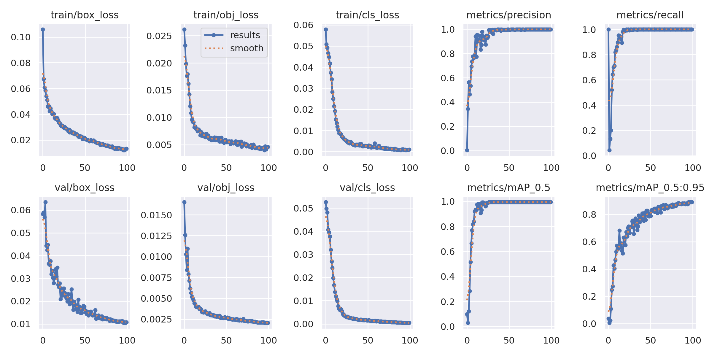

# Object Detection with YOLOv5
Final Project - Object detection using YOLOv5 algorithm

## 📋 Description
This project implements YOLOv5 for emergency vehicle detection. The system can perform real-time detection on images and videos.

**Objective**: Design and implement a real-time emergency vehicle detection system integrated with traffic light control.

## 📊 Dataset
- **Training**: 420 images
- **Validation**: 180 images  
- **Format**: YOLO (.txt)
- **Classes**: 6 classes
  - **Emergency Vehicles**: Ambulance, Fire Truck, Police Car
  - **Non-Emergency Vehicles**: Koenigsegg, Mclaren, Mercedes *(used for occlusion testing)*

📦 **Download complete dataset**: See [dataset/README.md](dataset/README.md)

## 🚀 Quick Start

### Install Dependencies
```bash
git clone https://github.com/hadysadya/final-project.git
cd final-project
pip install -r requirements.txt
```

### Run Detection
```bash
# Image detection
python src/detect.py --weights models/best.torchscript --source image.jpg

# Video detection
python src/detect.py --weights models/best.torchscript --source video.mp4

# Webcam detection
python src/detect.py --weights models/best.torchscript --source 0
```

### Training (Optional)
```bash
python src/train.py --img 640 --batch 16 --epochs 100 --data dataset/data.yaml
```

## 📈 Results
| Metric | Value |
|--------|-------|
| mAP@0.5 | 0.99 |
| Precision | 0.99 |
| Recall | 1 |

**Training Graphs:**


**Detection Example:**


## 📁 Project Structure
```
final-project/
├── dataset/           # Training & validation dataset
├── models/            # Model weights (best.torchscript)
├── src/               # Source code (train.py, detect.py)
├── exp_results/       # Training & evaluation results
├── notebooks/         # Jupyter notebooks
└── requirements.txt
```

## 🛠️ Tech Stack
- Python 3.8+
- PyTorch
- YOLOv5 (Ultralytics)
- OpenCV

## 👨‍🎓 Author
**Made Hady Sadya Wibawa**  
Student ID: 1101213240  
Telecommunication Engineering - Telkom University

**Supervisors**: Yulinda Eliskar, Rita Purnamasari

## 📚 References
1. Ultralytics YOLOv5. https://github.com/ultralytics/yolov5
2. G. Karmakar, A. Chowdhury, J. Kamruzzaman, and I. Gondal, "A Smart Priority-Based Traffic Control System for Emergency Vehicles," *IEEE Sensors Journal*, vol. 21, no. 14, pp. 15849-15860, July 2021.
3. S. Deepajothi and D. Palanival Rajan, "Intelligent Traffic Management for Emergency Vehicles using Convolutional Neural Network," in *2021 7th International Conference on Advanced Computing and Communication Systems (ICACCS)*, Coimbatore, India, 2021, pp. 1-6.
4. V.-T. Tran and W.-H. Tsai, "Audio-Vision Emergency Vehicle Detection," *IEEE Sensors Journal*, vol. 21, no. 24, pp. 27905-27917, Dec. 2021.

---
📧 Contact: hady17306@gmail.com  
⭐ If you find this helpful, give this repository a star!
