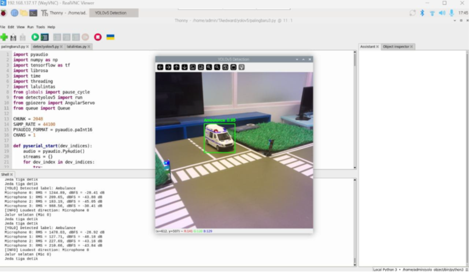

# 🚨 Emergency Vehicle Detection & Traffic Control System

**Prototype for Intelligent Traffic Management**

[](https://www.python.org/)
[](https://github.com/ultralytics/yolov5)
[](https://www.raspberrypi.com/)
[](https://github.com/hadysadya/final-project)

## 🎯 Project Overview

Proof-of-concept system that uses **computer vision** and **audio detection** to detect emergency vehicles (ambulance, fire truck, police) and automatically assign lane priority through traffic light control.

### Key Features

- 🎥 **Real-time Detection**: YOLOv5-based emergency vehicle detection
- 🎤 **4-Direction Audio**: Directional sound detection using 4 microphones
- ✅ **Dual Verification**: Audio + visual confirmation to reduce false positives
- 🎛️ **Servo Control**: Automatic camera orientation to sound source
- 🚦 **Traffic Light Control**: GPIO-based 4-way traffic light automation
- ⏱️ **Priority Mode**: 15-second green light hold for emergency vehicles

## ⚠️ Prototype Disclaimer

This is a **proof-of-concept prototype** created for:
- ✅ Academic demonstration
- ✅ Technology feasibility testing
- ✅ Educational purposes
- ❌ **NOT for production deployment**
- ❌ **NOT tested in real traffic scenarios**

**Limitations**:
- Limited dataset (600 images)
- Controlled environment testing only
- No safety certifications
- Requires extensive validation for real-world use

## 🛠️ Technology Stack

| Component | Technology |
|-----------|-----------|
| **Hardware** | Raspberry Pi 5 (8GB) |
| **Detection** | YOLOv5 (PyTorch) |
| **Camera** | Picamera2 (Camera Module) |
| **Audio** | PyAudio + 4x USB Microphones |
| **GPIO Control** | GPIOZero |
| **Servo** | AngularServo (0-180°) |
| **Language** | Python 3.11.2 |

## 📂 Repository Structure

```
final-project/
├── dataset/                    # Training dataset 
│   ├── train/                  # Training images sample
│   ├── valid/                  # Validation images sample
│   ├── data.yaml               # Config file
│   ├── README.dataset.txt      # Dataset metadata
│   ├── README.roboflow.txt     # Roboflow export info
│   └── README_DATASET.md       # Dataset documentation
│
├── models/                     # Trained models
│   └── best.torchscript        # Trained YOLOv5 (7MB)
│
├── src/
│   └── deployment/             # Deployment code
│       ├── main.py             # Main program
│       ├── detect_yolov5.py    # YOLO detection module
│       ├── traffic_control.py  # Traffic light control
│       ├── globals.py          # Global variables
│
├── notebooks/                  # Jupyter notebooks
│   └── training_notebook.ipynb # Model training notebook
│
├── exp_results/                # Training experiment results
│   └── runs/train/exp/         # Training metrics & logs
│
├── images/                     # Images example
│
├── README_DEPLOYMENT.md        # Deployment guide
├── THONNY_QUICKSTART.md        # Thonny IDE guide
└── README.md                   # This file
```

## 🚀 Quick Start

### Prerequisites

- Raspberry Pi 5 
- Picamera2-compatible camera
- 4x USB microphones
- Servo motor 
- 12x LEDs for traffic lights
- External power supply for servo

### Running the System

```bash
# Activate virtual environment
cd final-project
source venv/bin/activate

# Run main program
python3 src/deployment/main.py
```

**Or via Thonny IDE**: See [`THONNY_QUICKSTART.md`](THONNY_QUICKSTART.md)

## 📊 System Architecture

```
┌─────────────┐    ┌─────────────┐    ┌──────────────┐
│   Camera    │ >  |    YOLO     │ >  │  Detection   │
│ (Picamera2) │    │  Detection  │    │    Queue     │
└─────────────┘    └─────────────┘    └──────┬───────┘
                                             │
┌─────────────┐    ┌─────────────┐           │
│4x Microphone│ >  │   Audio     │           │
│  (PyAudio)  │    │ Processing  │           │
└─────────────┘    └──────┬──────┘           │
                          │                  │
                          └────────┬─────────┘
                                   ▼
                          ┌────────────────┐
                          │ Main Controller│
                          │ (Verification) │
                          └────────┬───────┘
                                   │
              ┌────────────────────┼────────────────────┐
              ▼                    ▼                    ▼
       ┌──────────┐         ┌──────────┐        ┌──────────┐
       │  Servo   │         │ Traffic  │        │ Logging  │
       │ Control  │         │  Lights  │        │  System  │
       └──────────┘         └──────────┘        └──────────┘
```

### Detection Logic

1. **Audio Detection**: 4 microphones detect sound from all directions
2. **Servo Movement**: Camera turns toward loudest sound source
3. **Visual Verification**: YOLO confirms emergency vehicle presence
4. **Dual Confirmation**: Proceed only if BOTH audio + visual detected
5. **Traffic Control**: Activate green light for emergency lane
6. **Priority Hold**: Maintain green for 15 seconds
7. **Cooldown**: 15-second cooldown before next detection

**Special Case**: North direction (camera limitation) → audio-only trigger

## 🎓 Academic Context

This project was developed as a **final project** demonstrating:
- Computer vision applications in traffic management
- Multi-modal sensor fusion (audio + visual)
- Real-time embedded systems programming
- IoT integration (camera, microphones, servo, GPIO)

**Course**: Thesis  
**Institution**: Telkom University  
**Supervisor**: Yulinda Eliskar & Rita Purnamasari
**Year**: 2025

## 📈 Performance (Prototype)

| Metric | Value | Status |
|--------|-------|--------|
| Detection Accuracy | ~85-90% | ✅ Good for prototype |
| Response Time | <2 seconds | ✅ Real-time capable |
| System Uptime | 2-4 hours continuous | ✅ Stable for demo |

## 📸 Demo



## 📚 Documentation

- **Deployment Guide**: [`README_DEPLOYMENT.md`](README_DEPLOYMENT.md)
- **Thonny IDE Guide**: [`THONNY_QUICKSTART.md`](THONNY_QUICKSTART.md)
- **Dataset Info**: [`dataset/README_DATASET.md`](dataset/README_DATASET.md)

## 🤝 Contributing

This is an academic prototype. For questions or suggestions:
- Open an [Issue](https://github.com/hadysadya/final-project/issues)
- Contact: hady17306@gmail.com

## 📄 License

**Academic/Educational Use Only**

This prototype is provided for educational purposes. Not licensed for commercial or production use.

## 🙏 Acknowledgments

- **YOLOv5**: [Ultralytics](https://github.com/ultralytics/yolov5)
- **Raspberry Pi Foundation**: Hardware platform
- **PyTorch Team**: Deep learning framework
- **Telkom University**: Academic support

## 📞 Contact

**Author**: Hady Sadya  
**Email**: hady17306@gmail.com  
**GitHub**: [@hadysadya](https://github.com/hadysadya)  
**Project Link**: [https://github.com/hadysadya/final-project](https://github.com/hadysadya/final-project)

---

**Status**: 🟡 Prototype (July 2025)  
**Version**: 1.0.0
